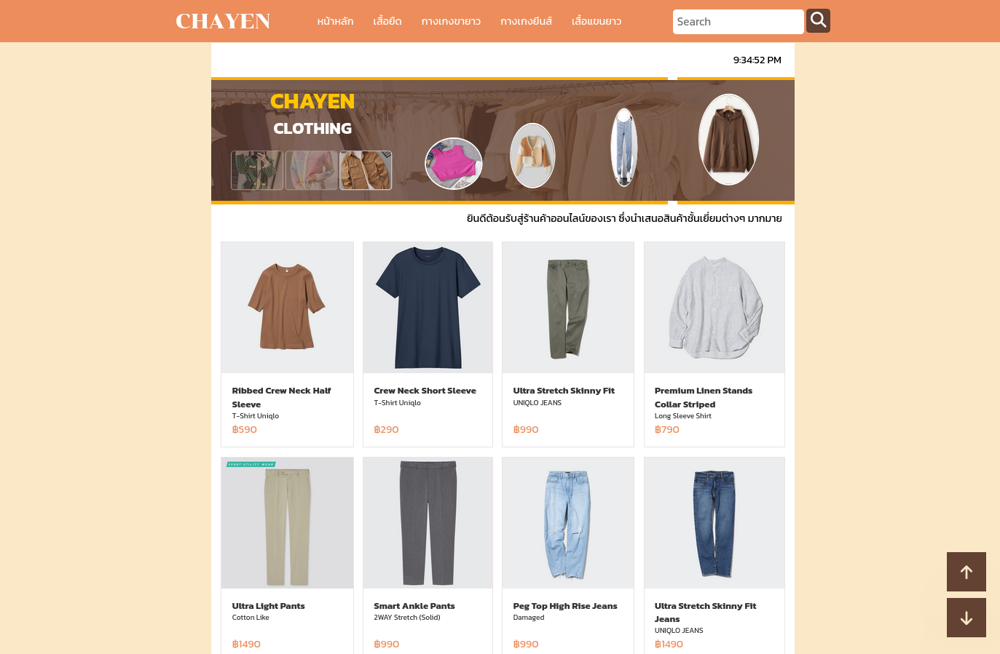
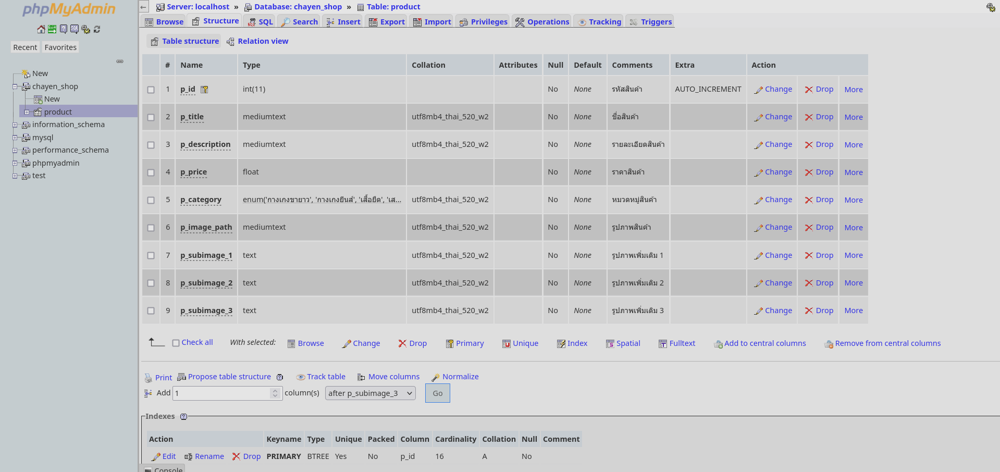

# ร้านขายเสื้อผ้า ชาเย็น
โปรเจคโฮสต์เว็บจำลองวิชา System Platform Administration ประจำปีการศึกษา 2565
ทำบน Arch Linux ใช้ XAMPP phpmyadmin และ mysql
เพิ่มเติมสำหรับ Arch Linux:
https://archlinux.org

เขียนเว็บไซต์โดยภาษา PHP และใช้ HTML + CSS + Javascript ในการแสดงผล

โดยมีสมาชิกดังนี้:
64010009 กร โรจน์รัตนปัญญา
64010300 ธงธน แหลมเขาทอง
64010232 ณัฐฌา สารมะโน

แบ่งภาระหน้าที่เป็น:
กร - หัวหน้าโปรเจค แบ่งงานให้ลูกทีม, ตัดต่อคลิป, ผู้ดูแล OS
ธงธน - ผู้บรรยาย, ผู้ดูแลฐานข้อมูล ออกแบบฐานข้อมูล
ณัฐชา - ผู้บรรยาย, ผู้ดูแลเว็บไซต์ ออกแบบเว็บไซต์ สร้างเว็บไซต์

หากมีข้อผิดพลาดประการใด ขออภัยมา ณ ที่นี้ด้วย
-- กร และ สมาชิก --

# Website

# Database structure

# คลิปสาธิตการทำ

